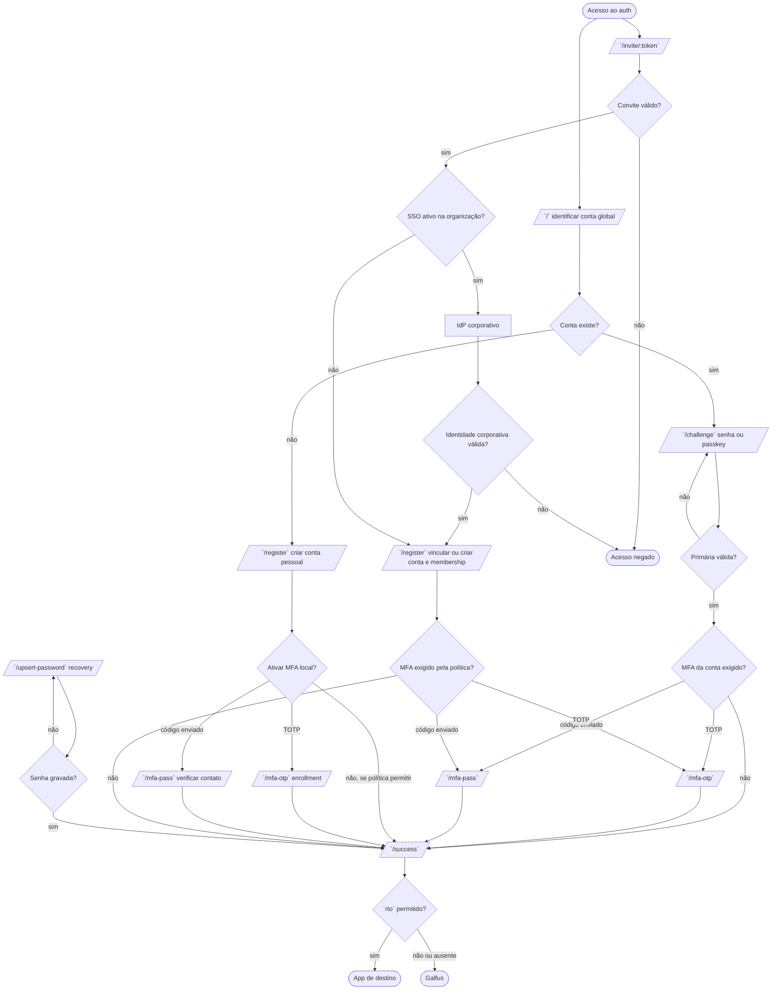
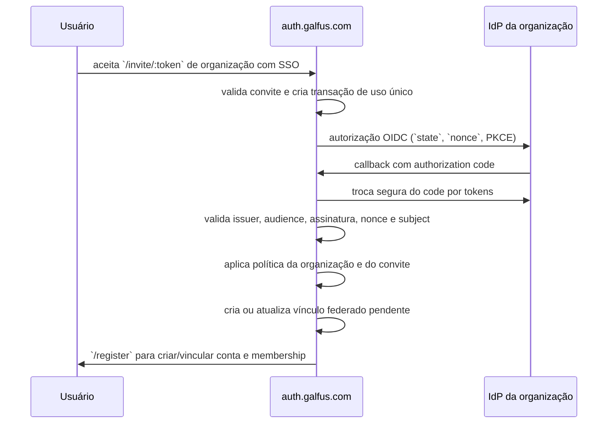

# Fluxo de autenticação

> Estado: planejamento. Este documento descreve o fluxo-alvo; não altera os
> endpoints ou o schema atuais.

## Convenções

- O endpoint final será `/success`, com dois `c`. Não criar `/sucess`.
- Cada jornada usa uma **transação de autorização** de curta duração. Ela tem
  uma intenção (`login`, `register`, `recovery` ou `invite`), organização e
  convite opcionais, o destino de retorno validado e o estado de cada etapa.
- A sessão autentica a **conta global**. A organização ativa é uma seleção de
  contexto, como no GitHub; cada app confirma que o membership da conta naquela
  organização continua ativo antes de autorizar um recurso.
- Um identificador de transação (por exemplo, ULID) não é um segredo. Tokens de
  autorização, OTPs, `state`, `nonce` e `code_verifier` precisam ser gerados
  com aleatoriedade criptográfica, expirar, ter uso único e não ficar em logs.
- `rto` continua limitado às origens Galfus permitidas. A tela `/success` nunca
  recebe token de sessão pela URL; a sessão é emitida em cookie HttpOnly antes
  de exibir ou redirecionar essa tela.

## Rotas alvo

| Rota | Responsabilidade | Próximo passo |
| --- | --- | --- |
| `/` | Normaliza email ou username e procura a conta global. | Conta existente: `/challenge`; inexistente: `/register` pessoal. |
| `/invite/:token` | Ponto de entrada do convite de uso único, válido por sete dias. Valida o token, inicia uma transação e verifica a política SSO da organização. | SSO ativo: IdP corporativo e depois `/register`; sem SSO: `/register` normal com contexto do convite. |
| `/register` | É público para conta pessoal. Com convite, cria ou vincula uma conta global à organização; com SSO ativo, exige primeiro a prova corporativa. | Conclusão: `/success`; enrollment escolhido: etapa MFA correspondente. |
| `/challenge` | Autenticação global: senha ou passkey. Uma organização pode pedir reautenticação/SSO próprio ao acessar recursos dela. | Sem MFA pendente: `/success`; com MFA: `/mfa-otp` ou `/mfa-pass`. |
| `/mfa-otp` | Verifica TOTP; no modo de enrollment, confirma o primeiro código antes de ativar o fator. | `/success`. |
| `/mfa-pass` | Verifica código de uso único enviado para contato previamente verificado (e-mail e/ou SMS). | `/success`. |
| `/success` | Confirma que a sessão foi emitida; oferece continuar ou redireciona automaticamente ao `rto` validado. | App de destino. |
| `/upsert-password` | Define ou troca senha da conta global a partir de uma transação `invite` que permita senha local ou `recovery`. | MFA, se exigido; caso contrário, `/success`. |

O link de convite carrega um **token aleatório opaco** de uso único; o banco
guarda somente o hash desse token. Ele não deve carregar o hash armazenado no
banco, pois este não serve para comprovar posse. Depois da validação, uma
transação de autorização é guardada no servidor/cookie seguro. O convite expira
em sete dias; seu envio ficará a cargo do futuro portal da organização.
`/register` pode conter o
questionário de MFA como uma etapa interna. Se o enrollment ficar mais complexo,
a mesma transação pode abrir `/mfa-otp` em modo `enroll`; o modo deve estar no
estado do servidor, não em um parâmetro livre da URL.

## Fluxograma alvo



## Estado e segurança que precisam existir antes da implementação

### Transação de autorização

Criar uma entidade/armazenamento de curta duração, por exemplo
`auth_transaction`, contendo: intenção, conta ou identidade normalizada quando
aplicável, `rto` já validado, método primário concluído, fator MFA pendente,
expiração, consumo e contexto de SSO. A UI recebe só uma referência opaca; a
fonte de verdade permanece no servidor.

O JWT de fluxo atual no parâmetro `state` é assinado e tem expiração, mas ainda
aparece na URL, no histórico e potencialmente em logs ou cabeçalhos Referer.
Para os fluxos acima, a transação opaca é a opção preferível.

### Formato recomendado: identificador + verificador

Cada transação tem duas partes:

```text
auth transaction ID:  ULID público, usado somente para lookup
browser verifier:     32 bytes aleatórios, codificados em base64url
cookie:               <transaction-id>.<browser-verifier>
database:             transaction-id + SHA-256(browser-verifier)
```

O ULID facilita indexação, rastreio e expiração; ele **não** autentica ninguém.
O verificador é gerado com CSPRNG e é a prova de posse. O app guarda o par em
cookie `HttpOnly`, `Secure`, `SameSite=Lax`, com path `/`, por no
máximo 10–15 minutos. O banco guarda apenas o hash do verificador e nunca aceita
o ID isoladamente. O padrão identificador + segredo permite lookup eficiente sem
deixar um dump do banco reutilizar transações ativas. [OWASP Session Management
Cheat Sheet](https://cheatsheetseries.owasp.org/cheatsheets/Session_Management_Cheat_Sheet.html)

O nome do cookie deve ser uma constante em `@galfus/constants`, por exemplo
`COOKIES_KEYS.auth_transaction`; o `apps/auth` é quem o cria, renova e remove.
O `data-manager` recebe a instância do banco e o token opaco, mas nunca manipula
cookies ou redirects.

### Campos de `auth_transaction`

| Campo | Uso |
| --- | --- |
| `id` | ULID público da transação. |
| `intent` | `login`, `register`, `invite`, `recovery` ou `upsert_password`. |
| `status` | Estado finito: `pending`, `awaiting_sso`, `awaiting_primary`, `awaiting_mfa`, `authorized`, `completed`, `failed` ou `expired`. |
| `account`, `organization`, `invitation`, `ssoConnection` | Referências opcionais que definem o escopo imutável da jornada. |
| `returnTo` | Destino já validado no início; nunca aceitar novo `rto` de um form posterior. |
| `browserVerifierHash` | SHA-256 do segredo mantido no cookie. |
| `oidcStateHash`, `oidcNonceHash` | Hashes dos valores únicos usados no callback OIDC. |
| `pkceVerifierCiphertext` | Verificador PKCE cifrado, acessível apenas até a troca do authorization code. |
| `primaryMethod`, `pendingMfaMethod` | Evidência de etapas já concluídas e próxima etapa permitida. |
| `attempts`, `expiresAt`, `consumedAt`, `version` | Rate limit, expiração, uso único e concorrência otimista. |

Não armazenar senha, OTP, token de sessão, access token ou refresh token do IdP
em claro na transação. Quando for inevitável manter um segredo de curta duração,
como o `code_verifier` PKCE, cifrá-lo e removê-lo logo após o uso.

### Operações atômicas

O `data-manager` deve expor operações pequenas, sempre recebendo `unknown`,
validando com Valibot e fazendo a transição em uma única query/transação:

1. `startAuthTransaction`: cria o registro e devolve o ID + verificador apenas
   ao app; o app grava o cookie.
2. `getAuthTransaction`: valida formato, hash do verificador, expiração e
   status; nunca retorna segredos internos para a UI.
3. `advanceAuthTransaction`: exige `status` esperado e `version` esperada,
   grava a próxima etapa e incrementa a versão. Duas abas não podem concluir a
   mesma etapa.
4. `completeAuthTransaction`: valida todas as provas exigidas, cria/atualiza
   conta ou membership quando aplicável, cria uma sessão revogável e marca a
   transação como consumida na mesma operação lógica. O app recebe a credencial
   opaca da sessão e a grava em cookie.
5. `expireAuthTransactions`/limpeza: remove ou anonimiza registros expirados;
   nenhum endpoint deve aceitá-los mesmo antes da limpeza.

`completed`, `failed` e `expired` são terminais. O app remove o cookie em todo
estado terminal e também em logout.

### Callback OIDC e convite

Ao iniciar SSO, a transação já validada gera `state`, `nonce` e PKCE novos, todos
específicos daquela transação. O `state` pode carregar `transaction-id` e um
segredo aleatório próprio; o servidor guarda somente seu hash. No callback, o
Galfus exige simultaneamente: `state` válido e não consumido, cookie da mesma
transação, issuer/conexão esperados, `nonce` do ID Token e PKCE `S256`. Só então
troca o code e avança para `authorized`. Isso impede callback injetado, mix-up e
replay. OIDC/PKCE exige que esses valores sejam específicos e vinculados ao
navegador que iniciou a jornada. [RFC 9700](https://www.rfc-editor.org/rfc/rfc9700.html)

O convite segue o mesmo princípio: o token aleatório exposto no link é hashado
no banco, expira em sete dias e só é marcado como consumido ao completar o
membership. Se o navegador voltar durante o SSO, a transação pendente permite
continuar; uma segunda transação não pode usar o mesmo convite simultaneamente.

### Ativação e métodos MFA

O campo atual `account.mfaEnabled` informa apenas que há MFA, não qual fator
está disponível nem seu enrollment. Antes de criar as rotas, modelar:

- MFA é uma proteção **global da conta Galfus**, independente do IdP e da
  organização. Uma autenticação ou MFA feito no IdP não satisfaz nem substitui
  um fator Galfus: a mesma conta pode pertencer a organizações diferentes.
- métodos MFA por conta (`totp`, `email_otp`, `sms_otp`, recovery codes);
- estado `pending`, `active`, `disabled` e datas de verificação;
- contato de e-mail/telefone já verificado para códigos enviados;
- segredo TOTP cifrado em repouso, nunca como valor em claro;
- hash do código de uso único, expiração curta, limite de tentativas e consumo
  atômico;
- códigos de recuperação armazenados apenas como hash.

Passkeys também não devem permanecer como uma string genérica em
`account_key.value`: uma credencial WebAuthn requer identificador, chave pública,
contador e metadados de credencial. Vale modelá-la em tabela própria ou em uma
estrutura validada antes de habilitar `/challenge` com passkey.

O envio de e-mail e SMS é uma fase posterior. Para não acoplar o schema ao
provedor de entrega, preparar somente os dados genéricos: `account_contact`
com tipo (`email` ou `phone`), valor normalizado e `verifiedAt`, e uma challenge
de uso único com propósito, hash do código, expiração, tentativas e consumo.
Nenhum adaptador de e-mail/SMS precisa ser implementado nesta fase.

### Registro pendente e vínculo de organização

Uma conta pessoal pode ser criada sem organização e ficar `active` após cumprir
as regras globais. Já a relação `belongs_to` criada por convite deve permanecer
em estado `pending_activation` até concluir SSO e MFA exigidos pela organização.
Esse estado pertence ao membership, não à conta global: a pessoa pode continuar
usando sua conta pessoal ou outras organizações enquanto não tem acesso àquela
organização específica. Se a organização ativou SSO, a prova corporativa é
obrigatória para ativar esse vínculo; ela não substitui a sessão global nem
passa a controlar a conta pessoal.

### Upsert de senha

`/upsert-password` não deve aceitar uma identidade livre. A transação define
uma das intenções:

- `invite`: cria a primeira senha quando o convite/organização permite senha
  local;
- `recovery`: troca uma senha depois de prova de posse do canal de recuperação.

Ambas devem invalidar a transação e sessões/recovery codes relevantes após o
uso. Para uma troca de senha de conta logada, exigir reautenticação recente ou
MFA conforme a política.

## Federação corporativa: Galfus como cliente

O Galfus **não** emite SSO para outros sistemas. Cada organização pode conectar
o seu próprio IdP corporativo; quando conectado, o Galfus atua como Relying
Party/cliente dessa conexão. O modelo é agnóstico de fornecedor: Microsoft Entra
ID, Okta, Google Workspace, Keycloak, Auth0 ou outro IdP compatível entram pela
mesma abstração.

A integração recomendada é **OpenID Connect Authorization Code Flow com
PKCE**. SAML 2.0 fica como adaptador para organizações que só ofereçam SAML.



OIDC é preferível porque OAuth puro autoriza acesso a recursos, mas não
padroniza a asserção de identidade; OIDC acrescenta autenticação e o ID Token.
O fluxo de authorization code, a validação do ID Token e PKCE são partes
necessárias da integração. [OpenID Connect Core](https://openid.net/specs/openid-connect-core-1_0.html), [RFC 7636 (PKCE)](https://www.rfc-editor.org/rfc/rfc7636.html)

### Convite controla membership; conta pessoal é independente

Existe auto-registro de **conta pessoal**, sem organização. Um administrador só
precisa criar convite para conceder vínculo com uma organização. Quando a
organização tem SSO ativo, o convite é associado à sua conexão SSO e a pessoa
só ganha a relação `belongs_to` depois de:

1. apresentar um convite válido, expirável e de uso único;
2. quando a organização tiver SSO ativo, autenticar com sucesso na conexão SSO
   definida pelo convite;
3. atender a política do convite, como domínio/claim permitido, grupo ou papel;
4. concluir MFA local, se a política da organização exigir.

Se a organização não tem SSO ativo, o mesmo convite pula a autenticação externa
e permite o registro normal ou o vínculo de uma conta Galfus já autenticada.
Uma conta pessoal pode criar sua própria organização posteriormente; essa
organização começa sem SSO até que um administrador conecte um IdP.

O convite pode ser vinculado a e-mail como indício de destino, mas a identidade
autoritativa é o `subject` retornado pelo IdP. Se a claim de e-mail divergir da
convidada, a organização decide explicitamente se bloqueia ou permite o caso;
não deve haver vínculo implícito por igualdade de e-mail.

### Regra de existência e revogação

A regra de produto fica: **uma pessoa só pode acessar uma organização com SSO
enquanto sua identidade externa estiver ativa e autorizada por aquela conexão**.
Isso não desativa sua conta global nem memberships em outras organizações.

Uma autenticação OIDC/SAML nova já falha quando o IdP recusa uma pessoa
desativada. Mas a revogação de sessões existentes depende das capacidades da
conexão; não é possível prometer bloqueio imediato apenas com um JWT local de
longa duração. Para cada `organization_sso_connection`, registrar capacidades
como:

- deprovisionamento por SCIM ou webhook de evento;
- OIDC Back-Channel Logout, introspection ou outra consulta de sessão;
- claims/grupos que podem ser verificados no login;
- intervalo de reconciliação quando não houver evento de revogação.

O comportamento-base é negar novos logins quando o IdP nega a autenticação. Para
revogar sessões de forma rápida, armazenar sessões no servidor (ou validar um
estado/versão de sessão em toda requisição autenticada), consumir o canal de
deprovisionamento disponível e executar reconciliação periódica. Ao receber a
revogação, preservar a conta para auditoria, marcar o membership como
`revoked`/`disabled` e invalidar apenas as sessões ou grants vinculados àquela
organização. `account.status` é reservado para bloqueios globais da conta.

### Modelo de dados proposto

Além de `organization` e da relação `belongs_to` já existentes, planejar:

- `organization_sso_connection`: organização, protocolo (`oidc` ou `saml`),
  issuer/metadados, política de claims e status. Segredos de cliente ficam em
  cofre/variáveis de ambiente, não no registro público do banco;
- `organization_invitation`: organização, conexão opcional, papel a conceder,
  e-mail opcional, expiração, uso/consumo e criador;
- `account_federated_identity`: `account`, conexão, issuer e `subject`, com
  índice único por conexão/issuer/subject;
- `auth_session` e `auth_transaction`: sessão revogável e jornada curta de
  convite/login/MFA;
- uma relação de membership por organização, evoluindo `belongs_to` para ter
  status, origem do convite, conexão usada e data de revogação.

Não usar e-mail, UPN ou display name como chave de vínculo: esses atributos
podem mudar. A conexão e o `subject` estável do IdP são a chave.

Após o SSO, a transação verifica o MFA global da conta Galfus quando ele estiver
ativo ou for exigido pela política aplicável. A garantia do IdP não substitui um
fator Galfus, pois a conta pode participar de outras organizações. Isso é uma
regra de autorização, não um botão da interface.

## Diferenças entre a implementação atual e o fluxo alvo

- Já existem: normalização email/username, consulta de identidade, criação de
  senha com Argon2, emissão de sessão, `rto` com allowlist e i18n.
- O registro pessoal atual pode continuar público, mas ainda não distingue
  conta global de membership por organização nem aceita contexto de convite.
- `/challenge` hoje verifica só senha; a tela de passkey é visual.
- `/mfa` é apenas uma tela estática; as rotas propostas serão `/mfa-otp` e
  `/mfa-pass`.
- Não há `/success`, `/upsert-password`, recuperação, convite, conexão SSO,
  contatos verificados, transação persistida, membership com status ou
  deprovisionamento externo.

## Ordem recomendada de implementação

1. Definir política por organização: SSO ativo ou inativo, regra de convite,
   claims/grupos aceitos e MFA exigido.
2. Modelar conexão SSO, convite, identidade federada, membership, sessão e
   transação; gerar tipos com SurrealKit e expor operações via data-manager.
3. Trocar o JWT de fluxo em query string pela transação opaca e implementar
   conta pessoal + convite sem SSO + `/success` end-to-end.
4. Integrar deprovisionamento/reconciliação da conexão e sessão revogável.
5. Integrar OIDC no caminho de convite para organizações com SSO ativo; depois
   adicionar SAML quando houver IdP que o exija.
6. Fechar MFA local (TOTP, passkey e códigos enviados) e
   `/upsert-password` conforme a política global e da organização.

## Decisões pendentes para fechar o desenho

### Bloqueiam schema e implementação inicial

1. **Sessão e organização ativa — decidido:** a sessão pertence apenas à conta
   global. O usuário seleciona a organização ativa; o app verifica o membership
   dessa organização por requisição ou por grant revogável.
2. **Política SSO por organização — decidido:** SSO é exigido para ativar o
   vínculo criado por convite quando a organização o tiver ativo. A revogação
   recebida por webhook desativa somente esse membership.
3. **Convites — parcialmente decidido:** link com token opaco de uso único,
   hashado no banco e com validade de sete dias. O portal da organização fará o
   envio depois. Ainda faltam papel inicial, reenvio, transferência de e-mail e
   reautenticação de conta já existente.
4. **Provisionamento com SSO — decidido:** todo vínculo com organização nasce
   de convite, tenha ela SSO ou não. Com SSO ativo, o convite acrescenta a prova
   corporativa antes de ativar o membership; sem SSO, faz o vínculo normal.
5. **MFA — parcialmente decidido:** os fatores são globais da conta Galfus e
   nunca são substituídos pelo MFA do IdP, pois uma conta pode pertencer a
   múltiplas organizações. A entrega por e-mail/SMS fica para uma fase futura;
   o schema deve prever contatos verificados e challenges, sem integrar um
   provedor agora. Ainda faltam decidir fatores da primeira versão, recuperação
   e se uma organização pode exigir que a conta já tenha MFA Galfus ativo.
6. **Revogação externa — decidido:** ocorre por webhook do sistema corporativo.
   Ainda falta definir o contrato do evento, assinatura, idempotência e o SLA de
   processamento; ele revoga o membership e grants daquela organização.
7. **Credenciais locais — parcialmente decidido:** senha e passkey pertencem à
   conta global, não ao membership. O SSO corporativo é exigido para ativar o
   vínculo por convite, não em cada acesso posterior. Ainda falta decidir a
   verificação de e-mail para criação e recuperação de senha; a entrega de
   e-mail/SMS não faz parte da primeira fase.

### Segurança e operação

8. **Tempos e limites:** TTL de convite, transação, OTP, challenge WebAuthn,
   sessão absoluta e ociosa; número de tentativas, rate limit por IP/identidade
   e resposta uniforme para não enumerar contas ou convites.
9. **Segredos e chaves:** onde ficam client secrets SSO, chaves de cifragem das
   transações e segredos TOTP; rotação, ambiente de desenvolvimento e acesso de
   operadores. Nunca guardar refresh token de IdP sem uma necessidade concreta.
10. **Auditoria:** quais eventos são imutáveis e por quanto tempo: criação e
    aceite de convite, login/erro SSO, mudança de fator, recovery, vínculo e
    desvínculo de identidade, revogação de membership e sessão.
11. **Ownership da organização:** regras para primeiro owner, convite de
    administradores, remoção/transferência do último owner e comportamento ao
    desativar ou trocar a conexão SSO.

### Podem ser fases posteriores

12. SAML, SCIM completo, múltiplas conexões ativas por organização, mapeamento
    automático de grupos do IdP para roles Galfus e login discovery por domínio.
13. Passkeys, recovery codes, autenticação por e-mail/SMS e step-up por ação
    sensível podem entrar gradualmente depois de sessão, convite e OIDC estarem
    fechados.

### Ordem mínima de decisão

Para começar a implementação com segurança, as decisões tomadas já permitem
criar as tabelas `organization_sso_connection`, `organization_invitation`,
`account_federated_identity`, `auth_transaction`, `auth_session`,
`account_contact` e evoluir `belongs_to`. Os itens **8–11** entram na primeira
entrega técnica; os itens **12–13** não precisam bloquear OIDC + convite.
